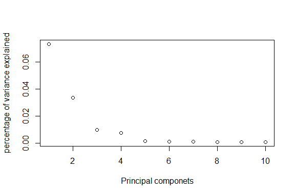
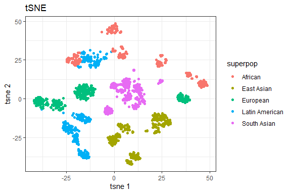
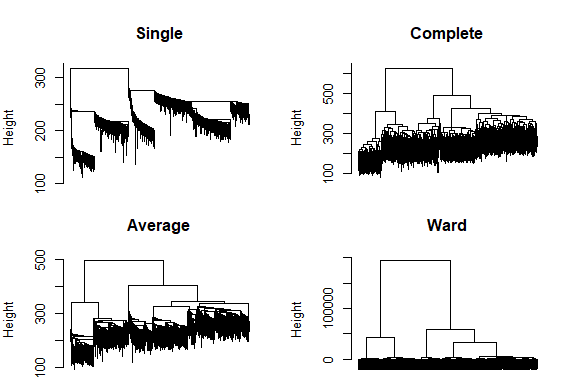
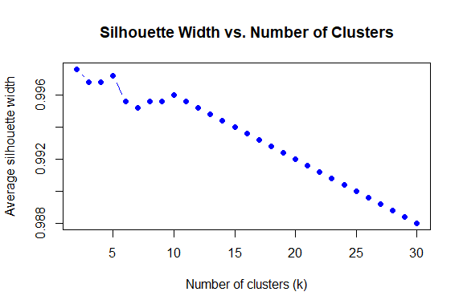

Application of Unsupervised learning to biological data
================

## Introduction

In this project I explore clustering genes and samples using Affymetrix
microarray data characterizing the gene expression profile of nebulin
knockout mice. This data was made available by [Li F et
al. (2015)](https://pubmed.ncbi.nlm.nih.gov/26123491/), with the GEO
accession number
[GSE70213](https://www.ncbi.nlm.nih.gov/sites/GDSbrowser?acc=GDS5881).
Here’s a bit of background info on nebulin and the rationale of the
study (quoted from the GEO entry):

> Nebulin is a giant filamentous protein that is coextensive with the
> actin filaments of the skeletal muscle sarcomere. Nebulin mutations
> are the main cause of nemaline myopathy (NEM), with typical NEM adult
> patients having low expression of nebulin, yet the roles of nebulin in
> adult muscle remain poorly understood. To establish nebulin’s
> functional roles in adult muscle we performed studies on a novel
> conditional nebulin KO (Neb cKO) mouse model in which nebulin deletion
> was driven by the muscle creatine kinase (MCK) promotor. Neb cKO mice
> are born with high nebulin levels in their skeletal muscle but within
> weeks after birth nebulin expression rapidly falls to barely
> detectable levels Surprisingly, a large fraction of the mice survives
> to adulthood with low nebulin levels (\<5% of control), contain
> nemaline rods, and undergo fiber-type switching towards oxidative
> types. These microarrays investigate the changes in gene expression
> when nebulin is deficient.

There are two genotypes in the study - the wildtype mice, and the
nebulin knockout mice. We will compare the results of different
clustering algorithms on the data, evaluate the effect of
filtering/feature selection on the clusters, and lastly, try to assess
if different attributes help explain the clusters we see.

## Load data and packages

### Install & load required libraries

The following code chunk will load required libraries. If you don’t
already have these installed, you’ll first need to install them
(recommended way is to use `BiocManager::install("packageName")`).

``` r
library(RColorBrewer)
library(cluster)
library(pvclust)
library(xtable)
library(limma)
library(tidyr)
library(dplyr)
library(GEOquery)
library(knitr)
```

    ## Warning: package 'knitr' was built under R version 4.4.1

``` r
library(pheatmap)
library(matrixStats)
library(ggplot2)
library(Rtsne)
theme_set(theme_bw()) # prettier ggplot plots 
```

### Download and read the data into R

``` r
# Get geo object that contains our data and phenotype information  
geo_obj <- getGEO("GSE70213", getGPL = FALSE)
```

    ## Found 1 file(s)

    ## GSE70213_series_matrix.txt.gz

``` r
geo_obj <- geo_obj[[1]]

geo_obj
```

    ## ExpressionSet (storageMode: lockedEnvironment)
    ## assayData: 35557 features, 24 samples 
    ##   element names: exprs 
    ## protocolData: none
    ## phenoData
    ##   sampleNames: GSM1720833 GSM1720834 ... GSM1720856 (24 total)
    ##   varLabels: title geo_accession ... tissue:ch1 (39 total)
    ##   varMetadata: labelDescription
    ## featureData: none
    ## experimentData: use 'experimentData(object)'
    ##   pubMedIds: 26123491 
    ## Annotation: GPL6246

``` r
options('download.file.method' = 'curl')
```

We have read in the data as an `ExpressionSet` object, with 35557
features (probes/genes), and 24 samples. The expression values are found
in the `exprs` slot. Now, we’ll do some reformatting of the phenotypic
(meta) data that is found in the `pData(geo_obj)` slot. Specifically,
we’ll keep only relevant columns, rename them to something more
convenient (since by default they are named “characteristics_ch#”, and
the specific characteristic is encoded in the values), and change
categorical variables to factors.

``` r
# keep only relevant columns
pData(geo_obj) <- pData(geo_obj) %>%
  select(organism_ch1, title, contains("characteristics"))
str(pData(geo_obj))
```

    ## 'data.frame':    24 obs. of  6 variables:
    ##  $ organism_ch1         : chr  "Mus musculus" "Mus musculus" "Mus musculus" "Mus musculus" ...
    ##  $ title                : chr  "quad-control-1" "quad-control-2" "quad-control-3" "quad-control-4" ...
    ##  $ characteristics_ch1  : chr  "tissue: quadriceps" "tissue: quadriceps" "tissue: quadriceps" "tissue: quadriceps" ...
    ##  $ characteristics_ch1.1: chr  "genotype: control" "genotype: control" "genotype: control" "genotype: control" ...
    ##  $ characteristics_ch1.2: chr  "Sex: male" "Sex: male" "Sex: male" "Sex: male" ...
    ##  $ characteristics_ch1.3: chr  "age: 41 days old" "age: 41 days old" "age: 41 days old" "age: 41 days old" ...

``` r
# Clean up covariate data
pData(geo_obj) <- pData(geo_obj) %>%
  rename(organism = organism_ch1,
         sample_name = title) %>%
  mutate(tissue = factor(gsub("tissue: ", "", characteristics_ch1)),
         genotype = factor(gsub("genotype: ", "",characteristics_ch1.1)),
         sex = factor(gsub("Sex: ", "",characteristics_ch1.2)),
         age = gsub("age: ", "",characteristics_ch1.3)) %>%
  select(-contains("characteristics"))
rownames(pData(geo_obj)) <- colnames(exprs(geo_obj))

head(pData(geo_obj))
```

    ##                organism    sample_name     tissue genotype  sex         age
    ## GSM1720833 Mus musculus quad-control-1 quadriceps  control male 41 days old
    ## GSM1720834 Mus musculus quad-control-2 quadriceps  control male 41 days old
    ## GSM1720835 Mus musculus quad-control-3 quadriceps  control male 41 days old
    ## GSM1720836 Mus musculus quad-control-4 quadriceps  control male 41 days old
    ## GSM1720837 Mus musculus quad-control-5 quadriceps  control male 42 days old
    ## GSM1720838 Mus musculus quad-control-6 quadriceps  control male 40 days old

## Exploratory analysis

Let us take a look at our expression values.

``` r
kable(head(exprs(geo_obj)[,1:5]))
```

|          |  GSM1720833 |  GSM1720834 |  GSM1720835 |  GSM1720836 |  GSM1720837 |
|:---------|------------:|------------:|------------:|------------:|------------:|
| 10338001 | 2041.408000 | 2200.861000 | 2323.760000 | 3216.263000 | 2362.775000 |
| 10338002 |   63.780590 |   65.084380 |   58.308200 |   75.861450 |   66.956050 |
| 10338003 |  635.390400 |  687.393600 |  756.004000 | 1181.929000 |  759.099800 |
| 10338004 |  251.566800 |  316.997300 |  320.513200 |  592.806000 |  359.152500 |
| 10338005 |    2.808835 |    2.966376 |    2.985357 |    3.352954 |    3.155735 |
| 10338006 |    3.573085 |    3.816430 |    3.815323 |    4.690040 |    3.862684 |

``` r
dim(exprs(geo_obj))
```

    ## [1] 35557    24

If we look in the meta data slot (`pData`), we should have 1 row
corresponding to each sample.

``` r
kable(head(pData(geo_obj)))
```

|            | organism     | sample_name    | tissue     | genotype | sex  | age         |
|:-----------|:-------------|:---------------|:-----------|:---------|:-----|:------------|
| GSM1720833 | Mus musculus | quad-control-1 | quadriceps | control  | male | 41 days old |
| GSM1720834 | Mus musculus | quad-control-2 | quadriceps | control  | male | 41 days old |
| GSM1720835 | Mus musculus | quad-control-3 | quadriceps | control  | male | 41 days old |
| GSM1720836 | Mus musculus | quad-control-4 | quadriceps | control  | male | 41 days old |
| GSM1720837 | Mus musculus | quad-control-5 | quadriceps | control  | male | 42 days old |
| GSM1720838 | Mus musculus | quad-control-6 | quadriceps | control  | male | 40 days old |

``` r
dim(pData(geo_obj))
```

    ## [1] 24  6

Now let us see how the gene values are spread across our dataset, with a
frequency histogram (using base R).

``` r
hist(exprs(geo_obj), col="gray", main="GSE70213 - Histogram")
```

<!-- -->

It appears a lot of genes have values \< 1000. What happens if we plot
the frequency distribution after Log2 transformation?

> Why might it be useful to log transform the data, prior to making any
> comparisons?

``` r
hist(log2(exprs(geo_obj)+1), col="gray", main="GSE70213 log transformed - Histogram")
```

<!-- -->

We’ll go ahead and work with the log2-transformed data for the remainder
of the analyses. Note that we actually don’t have any zeroes, so there’s
no need to add a pseudo count.

``` r
min(exprs(geo_obj))
```

    ## [1] 1.762702

``` r
exprs(geo_obj) <- log2(exprs(geo_obj))
```

Finally, we’ll center and scale the rows in our expression matrix, since
we’re not interested in absolute differences in expression *between*
genes at the moment. This additional step will make visualization easier
later. Essentially, for each gene we will subtract its mean, and divide
by its standard deviation (the same as z-scores). Note that the `scale`
function we will use to do this by default *operates on columns* so we
need to transpose with `t()` **before and after** using it in order to
center and the scale rows.

Since we still want to keep our original expression data, we’ll put this
in a separate matrix. Note that although one can do this step within the
`pheatmap()` function, it will not be available for other functions we
will use.

``` r
# row means and variances before scaling
rowMeans(head(exprs(geo_obj)))
```

    ##  10338001  10338002  10338003  10338004  10338005  10338006 
    ## 11.027001  5.781680  9.303747  8.078106  1.546001  1.859040

``` r
rowVars(head(exprs(geo_obj)))
```

    ##    10338001    10338002    10338003    10338004    10338005    10338006 
    ## 0.045129680 0.048330346 0.087031589 0.147846847 0.005240254 0.009708631

``` r
expr_scaled <- t(scale(t(exprs(geo_obj))))

# row means and variances after scaling
rowMeans(head(expr_scaled))
```

    ##      10338001      10338002      10338003      10338004      10338005 
    ## -3.489107e-15 -1.098658e-17 -2.006641e-15  1.811340e-15 -9.014780e-16 
    ##      10338006 
    ##  2.856511e-16

``` r
rowVars(head(expr_scaled))
```

    ## 10338001 10338002 10338003 10338004 10338005 10338006 
    ##        1        1        1        1        1        1

Now, let us try and consider how the various samples cluster across all
our genes. We will then try and do some feature selection, and see the
effect it has on the clustering of the samples. We will use the metadata
to annotate our clusters and identify interesting clusters. The second
part of our analysis will focus on clustering the genes across all our
samples.

## Sample Clustering

In this section, we will use samples as objects to be clustered using
gene attributes (i.e., each sample is a vector variable of dimension
~35K).  
First we will cluster the data using agglomerative hierarchical
clustering. Here, the partitions can be visualized using a
**dendrogram** at various levels of granularity. We do not need to input
the number of clusters, in this approach. Then, we will find various
clustering solutions using partitional clustering methods, specifically
K-means and partition around medoids (PAM). Here, the partitions are
independent of each other, and the number of clusters is given as an
input. As an exercise, you will pick a specific number of clusters, and
compare the sample memberships in these clusters across the various
clustering methods.

## Part I: Hierarchical Clustering

### Hierarchical clustering for mice knockout data

In this section we will illustrate different hierarchical clustering
methods.

However, for most expression data applications, we suggest you should:

- standardize the data
- use Euclidean as the “distance” (so it’s just like Pearson
  correlation)
- use “average linkage”

First, we’ll compute the distance with `dist` - the default distance
metric is euclidean. Note that we need to transpose the data with `t`
since `dist` computes distances between rows (and our samples are in
columns). The result is a distance object with all the pairwise
euclidean distances between samples.

``` r
# compute pairwise distances
pr.dis <- dist(t(expr_scaled), method = 'euclidean')
str(pr.dis)
```

    ##  'dist' num [1:276] 205 214 322 225 257 ...
    ##  - attr(*, "Size")= int 24
    ##  - attr(*, "Labels")= chr [1:24] "GSM1720833" "GSM1720834" "GSM1720835" "GSM1720836" ...
    ##  - attr(*, "Diag")= logi FALSE
    ##  - attr(*, "Upper")= logi FALSE
    ##  - attr(*, "method")= chr "euclidean"
    ##  - attr(*, "call")= language dist(x = t(expr_scaled), method = "euclidean")

Now, we’ll compute hierarchical clustering using `hclust` using 4
different linkage types, and plot them. Check out `?hclust` to learn
more about these settings. We set some plotting options to reduce the
margins, and to arrange the plots 2 by 2.

``` r
pr.hc.s <- hclust(pr.dis, method = 'single')
pr.hc.c <- hclust(pr.dis, method = 'complete')
pr.hc.a <- hclust(pr.dis, method = 'average')
pr.hc.w <- hclust(pr.dis, method = 'ward.D')

# plot them
op <- par(mar = c(0,4,4,2), mfrow = c(2,2))

plot(pr.hc.s, labels = FALSE, main = "Single", xlab = "")
plot(pr.hc.c, labels = FALSE, main = "Complete", xlab = "")
plot(pr.hc.a, labels = FALSE, main = "Average", xlab = "")
plot(pr.hc.w, labels = FALSE, main = "Ward", xlab = "")
```

<!-- -->

``` r
par(op)
```

We can look at the trees that are output from different clustering
algorithms. However, it can also be visually helpful to identify what
sorts of trends in the data are associated with these clusters. We can
look at this output using heatmaps. We will be using the `pheatmap`
package for this purpose.

Recall that when you call `pheatmap()`, it automatically performs
hierarchical clustering for you and it reorders the rows and/or columns
of the data accordingly. Both the reordering and the dendrograms can be
suppressed with `cluster_rows = FALSE` and/or `cluster_cols = FALSE`.

*Note that when you have a lot of genes, the tree is pretty ugly. Thus,
we’ll suppress row clustering for now since we are plotting all genes.*

By default, `pheatmap()` uses the `hclust()` function, which takes a
distance matrix, calculated by the `dist()` function (with
`default = 'euclidean'`). However, you can also write your own
clustering and distance functions. In the examples below, I used
`hclust()` with `ward.D2` linkage method and the `euclidean` distance.

*Note that the dendrogram in the top margin of the heatmap is the same
as that of the `hclust()` function*

``` r
# set pheatmap clustering parameters
clust_dist_col = "euclidean" 
clust_method = "ward.D2"
clust_scale = "none"

## the annotation option uses the covariate object (pData(geo_obj)). It must have the same rownames, as the colnames in our data object (expr_scaled).  

pheatmap(expr_scaled, 
         cluster_rows = FALSE, 
         scale = clust_scale, 
         clustering_method = clust_method, 
         clustering_distance_cols = clust_dist_col, 
         show_colnames = TRUE, show_rownames = FALSE,  
         main = "Clustering heatmap for GSE70213", 
         annotation = pData(geo_obj)[,c("tissue","genotype")])
```

<!-- -->

``` r
# Your code here
clust_dist_col = "correlation" 
clust_method = "ward.D2"
clust_scale = "none"

## the annotation option uses the covariate object (pData(geo_obj)). It must have the same rownames, as the colnames in our data object (expr_scaled).  

pheatmap(expr_scaled, 
         cluster_rows = FALSE, 
         scale = clust_scale, 
         clustering_method = clust_method, 
         clustering_distance_cols = clust_dist_col, 
         show_colnames = TRUE, show_rownames = FALSE,  
         main = "Clustering heatmap for GSE70213", 
         annotation = pData(geo_obj)[,c("tissue","genotype")])
```

<!-- -->

We can also change the colours of the different covariates.

``` r
## We can change the colours of the covariates  
var1 = c("darkblue","darkred")
names(var1) = levels(pData(geo_obj)$tissue)
var2 = c("grey","black")
names(var2) = levels(pData(geo_obj)$genotype)
covar_color = list(tissue = var1, genotype = var2)

my_heatmap_obj = pheatmap(expr_scaled, 
                          cluster_rows = FALSE, 
                          scale = clust_scale, 
                          clustering_method = clust_method, 
                          clustering_distance_cols = clust_dist_col, 
                          show_rownames = FALSE, 
                          main = "Clustering heatmap for GSE70213",
                          annotation = pData(geo_obj)[,c("tissue","genotype")], 
                          annotation_colors = covar_color)
```

<!-- -->

We can also get clusters from our pheatmap object. We will use the
`cutree` function to extract the clusters. Note that we can do this for
samples (look at the `tree_col`) or for genes (look at the `tree_row`).
Note that we are literally cutting the tree by drawing a horizontal line
either at a particular height (the `h` parameter in `cutree`), or at the
height that gives us k clusters (the `k` parameter in `cutree`). Here
we’ll obtain a clustering with 10 clusters.

``` r
cluster_samples = cutree(my_heatmap_obj$tree_col, k = 10)
kable(cluster_samples)
```

|            |   x |
|:-----------|----:|
| GSM1720833 |   1 |
| GSM1720834 |   1 |
| GSM1720835 |   1 |
| GSM1720836 |   2 |
| GSM1720837 |   1 |
| GSM1720838 |   3 |
| GSM1720839 |   4 |
| GSM1720840 |   4 |
| GSM1720841 |   5 |
| GSM1720842 |   4 |
| GSM1720843 |   4 |
| GSM1720844 |   4 |
| GSM1720845 |   6 |
| GSM1720846 |   7 |
| GSM1720847 |   7 |
| GSM1720848 |   7 |
| GSM1720849 |   7 |
| GSM1720850 |   8 |
| GSM1720851 |   9 |
| GSM1720852 |   9 |
| GSM1720853 |   9 |
| GSM1720854 |   9 |
| GSM1720855 |   9 |
| GSM1720856 |  10 |

Note you can do this with the base `hclust` method too, as shown here.
We are using one of the `hclust` objects we defined earlier in this
document. Let’s plot the dendrogram and highlight the 10 clusters.

``` r
# identify 10 clusters
op <- par(mar = c(1,4,4,1))
plot(pr.hc.w, labels = pData(geo_obj)$grp, cex = 0.6, main = "Ward, 10 clusters", xlab = "" )
rect.hclust(pr.hc.w, k = 10)
```

<!-- -->

``` r
par(op) 
```

We could save the heatmap we made to a PDF file for reference. Remember
to define the filename properly as the file will be saved relative to
where you are running the script in your directory structure.

``` r
# Save the heatmap to a PDF file
pdf ("GSE70213_Heatmap.pdf")
my_heatmap_obj
dev.off()
```

## Part II: Parametric and Alternative Non-Parametric Clustering with PCA and t-SNE

### Partitioning methods for mice knockout data

As we saw in the previous section, we can build clusters bottom-up from
our data, via agglomerative hierarchical clustering. This method
produces a dendrogram. As a different algorithmic approach, we can
pre-determine the number of clusters (k), iteratively pick different
‘cluster representatives’, called centroids, and assign the closest
remaining samples to it, until the solution converges to stable
clusters. This way, we can find the best way to divide the data into the
k clusters in this top-down clustering approach.

The centroids can be determined in different ways, as covered in
lecture. We will be covering two approaches, **k-means** (implemented in
`kmeans` function), and **k-medoids** (implemented in the `pam`
function).

> Note that the results depend on the initial values (randomly
> generated) to create the first k clusters. In order to get robust
> results, you may need to set many initial points (see the parameter
> `nstart`). You could also set a random seed to ensure the same results
> each time (but this won’t guarantee robustness).

#### K-means clustering

Keep in mind that k-means makes certain assumptions about the data that
may not always hold:  
- Variance of distribution of each variable (in our case, genes) is
spherical  
- All variables have the same variance  
- A prior probability that all k clusters have the same number of
members

Often, we have to try different ‘k’ values before we identify the most
suitable k-means decomposition. We can look at the mutual information
loss as clusters increase in count, to determine the number of clusters
to use.

Here we’ll just do a k-means clustering with k=5 of samples using all
genes (~35K). Note again that we have to transpose our expression matrix
so our samples are in rows since `kmeans` operates on rows.

``` r
#Objects in columns
set.seed(31)
k <- 5
pr.km <- kmeans(t(expr_scaled), centers = k, nstart =  50)

#We can look at the within sum of squares of each cluster
pr.km$withinss
```

    ## [1]      0.00 125694.08  94760.68 105507.14 110026.69

``` r
#We can look at the composition of each cluster
pr.kmTable <- data.frame(tissue = pData(geo_obj)$tissue, 
                         genotype = pData(geo_obj)$genotype, 
                         cluster = pr.km$cluster)
kable(pr.kmTable)
```

|            | tissue     | genotype   | cluster |
|:-----------|:-----------|:-----------|--------:|
| GSM1720833 | quadriceps | control    |       4 |
| GSM1720834 | quadriceps | control    |       4 |
| GSM1720835 | quadriceps | control    |       4 |
| GSM1720836 | quadriceps | control    |       1 |
| GSM1720837 | quadriceps | control    |       4 |
| GSM1720838 | quadriceps | control    |       4 |
| GSM1720839 | quadriceps | nebulin KO |       5 |
| GSM1720840 | quadriceps | nebulin KO |       5 |
| GSM1720841 | quadriceps | nebulin KO |       5 |
| GSM1720842 | quadriceps | nebulin KO |       5 |
| GSM1720843 | quadriceps | nebulin KO |       5 |
| GSM1720844 | quadriceps | nebulin KO |       5 |
| GSM1720845 | soleus     | control    |       2 |
| GSM1720846 | soleus     | control    |       2 |
| GSM1720847 | soleus     | control    |       2 |
| GSM1720848 | soleus     | control    |       2 |
| GSM1720849 | soleus     | control    |       2 |
| GSM1720850 | soleus     | control    |       2 |
| GSM1720851 | soleus     | nebulin KO |       3 |
| GSM1720852 | soleus     | nebulin KO |       3 |
| GSM1720853 | soleus     | nebulin KO |       3 |
| GSM1720854 | soleus     | nebulin KO |       3 |
| GSM1720855 | soleus     | nebulin KO |       3 |
| GSM1720856 | soleus     | nebulin KO |       3 |

#### PAM algorithm

In K-medoids clustering, K representative objects (medoids) are chosen
as cluster centers and objects are assigned to the center (medoid =
cluster) with which they have minimum dissimilarity (Kaufman and
Rousseeuw, 1990).  
Nice features of partitioning around medoids (PAM) are: (a) it accepts a
dissimilarity (distance) matrix (use `diss = TRUE`) (b) it is more
robust to outliers as the centroids of the clusters are data objects,
unlike k-means

Here we run PAM with k = 5.

``` r
pr.pam <- pam(pr.dis, k = 5)
pr.pamTable <- data.frame(tissue = pData(geo_obj)$tissue, 
                          genotype = pData(geo_obj)$genotype,
                          cluster = pr.pam$clustering)
kable(pr.pamTable)
```

|            | tissue     | genotype   | cluster |
|:-----------|:-----------|:-----------|--------:|
| GSM1720833 | quadriceps | control    |       1 |
| GSM1720834 | quadriceps | control    |       1 |
| GSM1720835 | quadriceps | control    |       1 |
| GSM1720836 | quadriceps | control    |       2 |
| GSM1720837 | quadriceps | control    |       1 |
| GSM1720838 | quadriceps | control    |       3 |
| GSM1720839 | quadriceps | nebulin KO |       3 |
| GSM1720840 | quadriceps | nebulin KO |       3 |
| GSM1720841 | quadriceps | nebulin KO |       3 |
| GSM1720842 | quadriceps | nebulin KO |       3 |
| GSM1720843 | quadriceps | nebulin KO |       3 |
| GSM1720844 | quadriceps | nebulin KO |       3 |
| GSM1720845 | soleus     | control    |       4 |
| GSM1720846 | soleus     | control    |       5 |
| GSM1720847 | soleus     | control    |       5 |
| GSM1720848 | soleus     | control    |       5 |
| GSM1720849 | soleus     | control    |       5 |
| GSM1720850 | soleus     | control    |       5 |
| GSM1720851 | soleus     | nebulin KO |       4 |
| GSM1720852 | soleus     | nebulin KO |       4 |
| GSM1720853 | soleus     | nebulin KO |       4 |
| GSM1720854 | soleus     | nebulin KO |       4 |
| GSM1720855 | soleus     | nebulin KO |       4 |
| GSM1720856 | soleus     | nebulin KO |       4 |

> Additional information on the PAM result is available through
> `summary(pr.pam)`

``` r
summary(pr.pam)
```

    ## Medoids:
    ##      ID               
    ## [1,] "2"  "GSM1720834"
    ## [2,] "4"  "GSM1720836"
    ## [3,] "7"  "GSM1720839"
    ## [4,] "21" "GSM1720853"
    ## [5,] "14" "GSM1720846"
    ## Clustering vector:
    ## GSM1720833 GSM1720834 GSM1720835 GSM1720836 GSM1720837 GSM1720838 GSM1720839 
    ##          1          1          1          2          1          3          3 
    ## GSM1720840 GSM1720841 GSM1720842 GSM1720843 GSM1720844 GSM1720845 GSM1720846 
    ##          3          3          3          3          3          4          5 
    ## GSM1720847 GSM1720848 GSM1720849 GSM1720850 GSM1720851 GSM1720852 GSM1720853 
    ##          5          5          5          5          4          4          4 
    ## GSM1720854 GSM1720855 GSM1720856 
    ##          4          4          4 
    ## Objective function:
    ##    build     swap 
    ## 160.3618 160.3618 
    ## 
    ## Numerical information per cluster:
    ##      size max_diss  av_diss diameter separation
    ## [1,]    4 207.1528 151.7822 225.4131   239.4018
    ## [2,]    1   0.0000   0.0000   0.0000   309.7719
    ## [3,]    7 246.9507 175.9213 282.3462   211.6935
    ## [4,]    7 226.3409 167.8522 253.6156   211.6935
    ## [5,]    5 222.8728 167.0281 222.8728   226.6721
    ## 
    ## Isolated clusters:
    ##  L-clusters: character(0)
    ##  L*-clusters: [1] 1 5
    ## 
    ## Silhouette plot information:
    ##            cluster neighbor   sil_width
    ## GSM1720834       1        3  0.25107164
    ## GSM1720837       1        3  0.24808552
    ## GSM1720835       1        3  0.17875520
    ## GSM1720833       1        5  0.14821250
    ## GSM1720836       2        1  0.00000000
    ## GSM1720842       3        4  0.22716094
    ## GSM1720843       3        4  0.21062659
    ## GSM1720840       3        4  0.17404239
    ## GSM1720839       3        4  0.15818558
    ## GSM1720844       3        4  0.11237092
    ## GSM1720841       3        4 -0.01105032
    ## GSM1720838       3        1 -0.02439076
    ## GSM1720851       4        5  0.20190820
    ## GSM1720852       4        3  0.18775471
    ## GSM1720855       4        3  0.18468227
    ## GSM1720853       4        5  0.16163701
    ## GSM1720854       4        5  0.14472032
    ## GSM1720856       4        3  0.14360989
    ## GSM1720845       4        5  0.02334617
    ## GSM1720848       5        4  0.16357358
    ## GSM1720849       5        4  0.15610914
    ## GSM1720846       5        4  0.15454582
    ## GSM1720847       5        4  0.12554254
    ## GSM1720850       5        4  0.08297369
    ## Average silhouette width per cluster:
    ## [1] 0.2065312 0.0000000 0.1209922 0.1496655 0.1365490
    ## Average silhouette width of total data set:
    ## [1] 0.1418114
    ## 
    ## Available components:
    ## [1] "medoids"    "id.med"     "clustering" "objective"  "isolation" 
    ## [6] "clusinfo"   "silinfo"    "diss"       "call"

We will now determine the optimal number of clusters in this experiment,
by looking at the average silhouette value. This is a statistic
introduced in the PAM algorithm, which lets us identify a suitable k.

**The silhouette plot** The `cluster` package contains the function
`silhouette()` that compares the minimum average dissimilarity
(distance) of each object to other clusters **with** the average
dissimilarity to objects in its own cluster. The resulting measure is
called the “width of each object’s silhouette”. A value close to 1
indicates that the object is similar to objects in its cluster compared
to those in other clusters. Thus, the average of all objects silhouette
widths gives an indication of how well the clusters are defined.

``` r
op <- par(mar = c(5,1,4,4))
plot(pr.pam, main = "Silhouette Plot for 5 clusters")
```

<!-- -->

``` r
par(op)
```

## Gene clustering

A different view at the data can be obtained from clustering genes
instead of samples. Since clustering genes is slow when you have a lot
of genes, for the sake of time we will work with a smaller subset of
genes.

In many cases, analysts use cluster analysis to illustrate the results
of a differential expression analysis. Sample clustering on
differentially expressed genes will unsurprisingly show the separation
of the groups specified in the DE analysis. Thus, as it was mentioned in
lectures, we need to be careful in over-interpreting these kind of
results (‘double-dipping’ the data). However, note that it is valid to
perform a gene clustering to see if differential expressed genes cluster
according to their function, subcellular localizations, pathways, etc.

#### A smaller dataset

#### Here well will fit an additive model and identify genes that show differential expression between nebulin KO and wildtype (control).

``` r
cutoff <-  1e-05
dsFit <- lmFit(exprs(geo_obj), 
               model.matrix(~ tissue + genotype, pData(geo_obj)))
dsEbFit <- eBayes(dsFit)
dsHits <- topTable(dsEbFit,
                   coef = c("genotypenebulin KO"),
                   p.value = cutoff, n = Inf)
nrow(dsHits)
```

    ## [1] 1221

``` r
topGenes <- rownames(dsHits)
```

We start by using different clustering algorithms to cluster the top
1221 genes that showed differential expression across the different
developmental stage (BH adjusted p value \< 10^{-5}).

#### Agglomerative Hierarchical Clustering

We can plot the heatmap using the `pheatmap` function. Notice how the
rows are now clustered.

``` r
pheatmap(exprs(geo_obj)[topGenes, ],
         scale = "row", 
         clustering_method = "average", 
         annotation = pData(geo_obj)[,c("tissue","genotype")], 
         show_rownames = FALSE)
```

<!-- -->

Or we can plot the dendrogram of genes using the `plot` function, after
we have made the hclust object.

``` r
geneC.dis <- dist(expr_scaled[topGenes,], method = 'euclidean')

geneC.hc.a <- hclust(geneC.dis, method = 'average')

plot(geneC.hc.a, labels = FALSE, main = "Hierarchical with Average Linkage", xlab = "")
```

<!-- -->

As you can see, when there are lots of objects to cluster, the
dendrograms are in general not very informative as it is difficult to
identify any interesting pattern in the data.

#### Partitioning Methods

The most interesting thing to look at is the cluster centers (basically
the “prototype” for the cluster) and membership sizes. Then we can try
to visualize the genes that are in each cluster.

Let’s visualize a cluster (remember the data were rescaled) using line
plots. This makes sense since we also want to be able to see the cluster
center.

``` r
set.seed(1234)
k <- 5
kmeans.genes <- kmeans(expr_scaled[topGenes,], centers = k)

# choose which cluster we want
clusterNum <- 2

df.centers <- data.frame(relexpr = kmeans.genes$centers[clusterNum, ],
                         sample = colnames(geo_obj),
                         genotype = pData(geo_obj)$genotype) 
df.genes <- data.frame(expr_scaled[topGenes,][kmeans.genes$cluster == clusterNum, ]) %>% 
  mutate(probe = topGenes[kmeans.genes$cluster == clusterNum]) %>%
  pivot_longer(values_to = "relexpr", names_to = "sample", cols = -probe)

ggplot() +
  geom_line(data = df.genes, 
            aes(x = sample, y = relexpr, group = probe),
            alpha = 0.2, linetype = "dashed", colour = "grey") +
  geom_line(data = df.centers,
            aes(x = sample, y = relexpr), group = 1) +
  geom_point(data = df.centers,
            aes(x = sample, y = relexpr, colour = genotype)) +
  theme(axis.text.x = element_text(angle = 90)) +
  ylab("Relative expression")
```

<!-- -->

## Evaluating clusters

### Choosing the right k

We need to find a balance between accurately grouping similar data into
one representative cluster and the “cost” of adding additional clusters.
Sometimes we don’t have any prior knowledge to tell us how many clusters
there are supposed to be in our data. In this case, we can use Akaike
Information Criterion
([AIC](http://en.wikipedia.org/wiki/Akaike_information_criterion)) and
Bayesian Information Criterion
([BIC](http://en.wikipedia.org/wiki/Bayesian_information_criterion)) to
help us to choose a proper k.

First, we calculate the AIC for each choice of k. We are clustering the
samples in this example:

``` r
set.seed(31)

k_max  <-  10  # the max number of clusters to explore clustering with 
km_fit  <-  list() # create empty list to store the kmeans object

for (i in 1:k_max){
  k_cluster  <-  kmeans(t(expr_scaled),centers=i, nstart =50)
  km_fit[[i]]  <-  k_cluster
}


# function calculate AIC
km_AIC  <-  function(km_cluster){
  m  <-  ncol(km_cluster$centers)
  n  <-  length(km_cluster$cluster)
  k  <-  nrow(km_cluster$centers)
  D  <-  km_cluster$tot.withinss
  return(D + 2*m*k)
}

# calculate AIC with our new function
aic <- sapply(km_fit, km_AIC)
```

Then, we plot the AIC vs. the number of clusters. We want to choose the
k value that corresponds to the elbow point on the AIC/BIC curve.

``` r
plot(seq(1,k_max), aic, 
     xlab = "Number of clusters",
     ylab = "AIC",
     pch = 20, cex = 2, main = "Clustering Samples" )
```

<!-- -->

Same for BIC

``` r
# calculate BIC
km_BIC  <-  function(km_cluster){
  m  <-  ncol(km_cluster$centers)
  n  <-  length(km_cluster$cluster)
  k  <-  nrow(km_cluster$centers)
  D  <-  km_cluster$tot.withinss
  return(D + log(n)*m*k)
}

bic <- sapply(km_fit,km_BIC)
plot(seq(1,k_max), bic, 
     xlab = "Number of clusters",
     ylab = "BIC",
     pch = 20, cex = 2, main="Clustering Samples" )
```

<!-- -->

## Dimension (feature) reduction

There are various ways to reduce the number of features (variables)
being used in our clustering analyses. One option is to subset the
number of variables (genes) based on variance, calculated using the
limma package (choosing genes with the highest shrunken gene-specific
variance). This way, we remove genes that are uninteresting since they
don’t vary much across samples.

### PCA plots

Another way we can reduce the number of features is using PCA (principal
components analysis). PCA assumes that the *most important*
characteristics of our data are the ones with the largest variance.
Furthermore, it takes our data and organizes it in such a way that
redundancy is removed as the most important variables are listed first.
The new variables will be linear combinations of the original variables,
with different weights.

In R, we can use `prcomp()` to do PCA. You can also use `svd()`.

> Make sure to set `scale` and `center` to FALSE if you input already
> scaled data (by default `center` is set to TRUE).

> CAUTION:`prcomp`’s centering and scaling is done on **columns** so you
> need to transpose the data if you want to center and scale in
> `prcomp`.

``` r
pcs <- prcomp(t(exprs(geo_obj)), center = TRUE, scale = TRUE)

# scree plot
plot(pcs) 
```

<!-- -->

``` r
# append the rotations for the first 10 PCs to the phenodata
prinComp <- cbind(pData(geo_obj), pcs$x[rownames(pData(geo_obj)), 1:10]) 

# scatter plot showing us how the first few PCs relate to covariates
plot(prinComp[ ,c("genotype", "tissue", "PC1", "PC2", "PC3")], pch = 19, cex = 0.8)
```

<!-- -->

Right away, you might be wondering *wait, should I run `prcomp` on my
data with genes in rows, or genes in columns?* That’s a great question,
since above we mentioned that, in particular, if you want to use the
centering and scaling feature in `prcomp` *the genes must be in
columns*. But, you could run it on already centered/scaled data where
the genes are in rows. It turns out that running `svd` on the data
matrix where samples are columns is exactly equivalent to `svd` on the
data matrix where the samples are rows, *if no centering has been done*.
It’s just that now, the meaning of the U and V matrices are swapped:

``` r
svd1 <- svd(t(exprs(geo_obj)))
svd2 <- svd(exprs(geo_obj))

all.equal(svd1$d, svd2$d)
```

    ## [1] TRUE

``` r
all.equal(svd1$u[,1], svd2$v[,1])
```

    ## [1] TRUE

``` r
all.equal(svd1$v[,1], svd2$u[,1])
```

    ## [1] TRUE

In terms of `prcomp`, it is the `rotation` and `x` matrices that are
swapped, although the equivalence with PCs is up to a scaling and
rotation. So, though it is convention to perform PCA with features
(genes) in columns for comparing samples, you can do it the other way
around (*if you’re careful to make sure it is the genes that are being
centered/scaled*) and achieve equivalent results up to a
scaling/rotation of the values of the PCs. Also note that if instead
you’re looking to find axes of variation of genes (instead of samples),
as in SVA, then the scaling/centering should be done on samples instead.
For more details, see lecture notes and [this section of Irizarry’s
Genomics Class online
book](https://genomicsclass.github.io/book/pages/pca_svd.html).

OK, on with our analysis. What does the sample spread look like, as
explained by their first 2 principal components?

``` r
plot(prinComp[ ,c("PC1","PC2")],  pch = 21, cex = 1.5)
```


Is the covariate `tissue` localized in the different clusters we see?

``` r
plot(prinComp[ ,c("PC1","PC2")], bg = pData(geo_obj)$tissue, pch = 21, cex = 1.5)
legend(list(x = 100, y = 150), as.character(levels(pData(geo_obj)$tissue)),
       pch = 21, pt.bg = c(1,2,3,4,5))
```


Is the covariate `genotype` localized in the different clusters we see?

``` r
plot(prinComp[ ,c("PC1","PC2")], bg = pData(geo_obj)$genotype, pch = 21, cex = 1.5)
legend(list(x = 100, y = 150), as.character(levels(pData(geo_obj)$genotype)),
       pch = 21, pt.bg = c(1,2,3,4,5))
```


PCA is a useful initial means of analysing any hidden structures in your
data. We can also use it to determine how many sources of variance are
important, and how the different features interact to produce these
sources.

First, let us first assess how much of the total variance is captured by
each principal component.

``` r
# Get the subset of PCs that capture the most variance in your predictors  
summary(pcs)
```

    ## Importance of components:
    ##                            PC1     PC2      PC3      PC4      PC5      PC6
    ## Standard deviation     83.9529 75.4320 58.56178 50.43800 40.20507 36.22631
    ## Proportion of Variance  0.1982  0.1600  0.09645  0.07155  0.04546  0.03691
    ## Cumulative Proportion   0.1982  0.3582  0.45469  0.52624  0.57170  0.60861
    ##                             PC7      PC8      PC9     PC10    PC11     PC12
    ## Standard deviation     33.82370 32.92129 31.79331 30.42552 30.1714 29.89299
    ## Proportion of Variance  0.03217  0.03048  0.02843  0.02603  0.0256  0.02513
    ## Cumulative Proportion   0.64078  0.67127  0.69969  0.72573  0.7513  0.77646
    ##                            PC13     PC14     PC15     PC16     PC17     PC18
    ## Standard deviation     29.26634 28.58766 28.34109 27.75436 27.33229 26.69535
    ## Proportion of Variance  0.02409  0.02298  0.02259  0.02166  0.02101  0.02004
    ## Cumulative Proportion   0.80055  0.82353  0.84612  0.86779  0.88880  0.90884
    ##                            PC19     PC20     PC21     PC22     PC23     PC24
    ## Standard deviation     26.52966 25.79456 25.54092 24.84522 24.54739 3.29e-13
    ## Proportion of Variance  0.01979  0.01871  0.01835  0.01736  0.01695 0.00e+00
    ## Cumulative Proportion   0.92863  0.94735  0.96569  0.98305  1.00000 1.00e+00

``` r
plot(pcs$sdev^2 / sum(pcs$sdev^2), ylab = "Proportion Variance Explained", xlab = "PC")
```

<!-- -->

We see that the first two principal components capture 35% of the total
variance. If we include the first 4 principal components, we capture
more than 50% of the total variance.  
Depending on which of these subsets you want to keep, we will select the
data from the first n components (e.g. the first n columns of the `x`
slot if genes are in columns). We can alternatively use the `tol`
parameter in `prcomp` to remove trailing PCs (components are omitted if
their standard deviations are less than or equal to tol times the
standard deviation of the first component).

``` r
pcs_2dim <- prcomp(t(exprs(geo_obj)), center = TRUE, scale = TRUE, tol = 0.5)
dim(pcs_2dim$x)
```

    ## [1] 24  4

It is common to see a cluster analysis on the first few principal
components to illustrate and explore the data.

### t-SNE plots

When we are dealing with datasets that have thousands of variables, and
we want to have an initial pass at identifying hidden patterns in the
data, another method we can use as an alternative to PCA is t-SNE. This
method allows for non-linear interactions between our features.

Importantly, there are certain caveats with using t-SNE.  
1. Solutions are not deterministic: While in PCA the *correct* solution
to a question is guaranteed, t-SNE can have many multiple minima, and
might give many different optimal solutions. It is hence
non-deterministic. This may make it challenging to generate reproducible
results.  
2. Clusters are not intuitive: t-SNE non-linearly collapses similar
points in high dimensional space, on top of each other in lower
dimensions. This means it maps features that are proximal to each other
in a way that global trends may be **warped** (distance is not
preserved). On the other hand, PCA always rotates our features in
specific ways that can be extracted by considering the covariance matrix
of our initial dataset and the eigenvectors in the new coordinate
space.  
3. Applying our fit to new data: t-SNE embedding is generated by moving
all our data to a lower dimensional state. It does not give us
eigenvectors (like PCA does) that can map/project new/unseen data to
this lower dimensional state.

The computational costs of t-SNE are also quite expensive, and finding
an embedding in lower space that makes sense may often require extensive
fientuning of several hyperparameters.

We will be using the `Rtsne` package to visualize our data using
t-SNE.  
In this plot we are changing the `perplexity` parameter for the two
different plots. As you see, the outputs are remarkably different.

``` r
# put genotype:tissue combination as a separate variable in metadata
pData(geo_obj) <- pData(geo_obj) %>%
  mutate(grp = interaction(tissue, genotype))
colors = rainbow(length(unique(pData(geo_obj)$grp)))
names(colors) = unique(pData(geo_obj)$grp)

# function to plot first two tsne dimensions given expressionset and perplexity value
tsnePlotPerplexity <- function(eset, perp){
  Rtsne(t(exprs(eset)), 
              pca_center = TRUE, pca_scale = TRUE,
              dims = 2, perplexity = perp, verbose = TRUE, max_iter = 100)$Y %>%
    data.frame() %>%
    mutate(`Tissue.Genotype` = pData(eset)$grp) %>%
    ggplot(aes(x = X1, y = X2, colour = `Tissue.Genotype`)) +
      geom_point() +
      xlab("tsne 1") +
      ylab("tsne 2") +
      ggtitle(paste0("tSNE, Perplexity ", perp))
}

tsnePlotPerplexity(eset = geo_obj, perp = 0.1)
```

    ## Performing PCA
    ## Read the 24 x 24 data matrix successfully!
    ## OpenMP is working. 1 threads.
    ## Using no_dims = 2, perplexity = 0.100000, and theta = 0.500000
    ## Computing input similarities...
    ## Perplexity should be lower than K!
    ## Building tree...
    ## Done in 0.00 seconds (sparsity = 0.000000)!
    ## Learning embedding...
    ## Iteration 50: error is 0.000000 (50 iterations in 0.00 seconds)
    ## Iteration 100: error is 0.000000 (50 iterations in 0.00 seconds)
    ## Fitting performed in 0.00 seconds.


``` r
tsnePlotPerplexity(eset = geo_obj, perp = 0.5)
```

    ## Performing PCA
    ## Read the 24 x 24 data matrix successfully!
    ## OpenMP is working. 1 threads.
    ## Using no_dims = 2, perplexity = 0.500000, and theta = 0.500000
    ## Computing input similarities...
    ## Building tree...
    ## Done in 0.00 seconds (sparsity = 0.069444)!
    ## Learning embedding...
    ## Iteration 50: error is 64.442923 (50 iterations in 0.00 seconds)
    ## Iteration 100: error is 62.960022 (50 iterations in 0.00 seconds)
    ## Fitting performed in 0.00 seconds.


``` r
tsnePlotPerplexity(eset = geo_obj, perp = 2)
```

    ## Performing PCA
    ## Read the 24 x 24 data matrix successfully!
    ## OpenMP is working. 1 threads.
    ## Using no_dims = 2, perplexity = 2.000000, and theta = 0.500000
    ## Computing input similarities...
    ## Building tree...
    ## Done in 0.00 seconds (sparsity = 0.322917)!
    ## Learning embedding...
    ## Iteration 50: error is 59.086076 (50 iterations in 0.00 seconds)
    ## Iteration 100: error is 60.806508 (50 iterations in 0.00 seconds)
    ## Fitting performed in 0.00 seconds.


